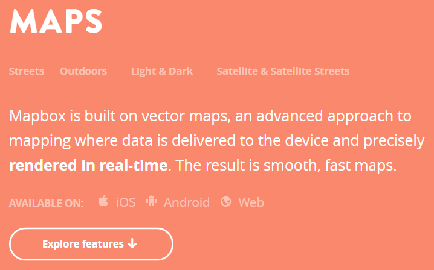

# GEO2311 - Høst 2016 - uke 42

## En innrømmelse, og en ny retning

Jeg har brukt helga til å ombestemme meg. I stedet for å gå videre med Open Layers og legge vektordata som egne lag over bilder fra WMS- eller WMTS-tjenester, har jeg kommet til at vi satser for fullt på ett kort:

Vector Tiles med Mapbox. Vi brukte Mapbox i emnet i fjor, og det gikk ganske bra. Men det var litt forvirrende også, for midt i semesteret la Mapbox om fra raster tiles til vector tiles. Etter litt om og men viste det seg at vi kunne fortsette med raster tiles likevel. Det var i 2015.

Nå er Mapbox veldig fokusert på vector tiles, selv om det fortsatt er mulig å bruke raster tiles. Men vector tiles passer egentlig ganske godt:

Vi skulle uansett jobbe med våre egne vektordata. Og på semesterplanen står både kartografi og vector tiles. Disse tre temaene kan behandles sammen hvis vi bruker Mapbox med vektor tiles.

Mer om det på torsdag. Bruk lenkene nedenfor til å komme litt inn i tematikken.

## Teori

Sentral tekst som viser hva som skiller Mapbox Vector Tiles fra f.eks. Open Layers:
- [Mapbox GL JS fundamentals](https://www.mapbox.com/help/mapbox-gl-js-fundamentals/)

## Aktiviteter

- lesing av teori
- utforsking på Mapboxs websider - se ressurser
- [Lynkurs i Mapbox - lag ditt første kart](mapbox-lynkurs.html)

## Forelesning/fellesaktivitet på torsdag

- Introduksjonsforelesning om Mapbox
- Tid for å gjennomføre lynkurs i Mapbox 
- Presentasjon av opplegg for medstudent-evaluering av Oblig 1. Vi setter av tid til å gjennomføre dette også.
- Presentasjon av Oblig 2 - oppgaven blir kanskje ikke 100% ferdig til da, men det viktigste skal være på plass.
- eventuelt

## Ressurser

### Mapbox

- [Hovedsiden for Mapbox](https://www.mapbox.com/)
- [Mapbox studio](https://www.mapbox.com/mapbox-studio/)
- [Massevis av kodeeksempler](https://www.mapbox.com/mapbox-gl-js/examples/)
- [Gallery - kart-inspirasjon](https://www.mapbox.com/gallery/)
- [Mapbox token - kodenøkkelen](https://www.mapbox.com/studio/account/tokens/)
- [Mapbox GL JS fundamentals](https://www.mapbox.com/help/mapbox-gl-js-fundamentals/)
- [Mapbox GL JS](https://www.mapbox.com/mapbox-gl-js/api/)
- [Mapbox konto-alternativer](https://www.mapbox.com/pricing/)

### WebGL - underliggende teknologi - grafikk-motoren
- [Wiki](https://www.khronos.org/webgl/wiki/Main_Page)
- [3D-demo: San Angeles Observation](https://www.khronos.org/registry/webgl/sdk/demos/google/san-angeles/index.html)
- [3D-demo: Earth](https://www.khronos.org/registry/webgl/sdk/demos/google/san-angeles/index.html)

